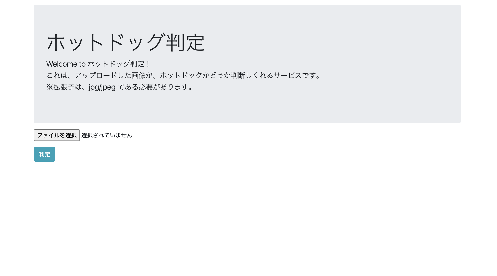
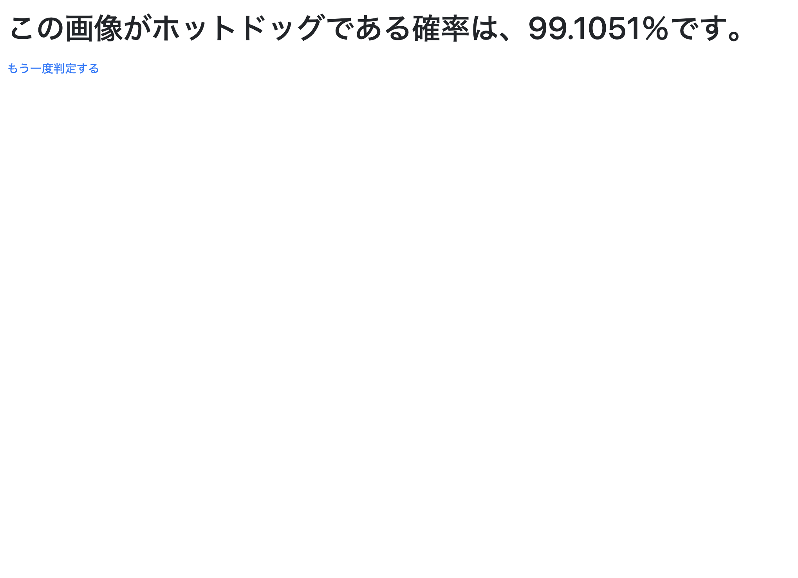

# ホットドッグ判定

画像をアップロードすると、それがホットドッグであるかを判定し、ホットドッグである確率を返してくれるアプリです。  
ディープラーニングを用いて画像分類モデルを作成し、アプリのバックエンドに組み込んでいます。

ホーム画面  


判定結果ページ  


## 使用技術
- 言語
  - Python
  - HTML
- フレームワーク
  - アプリケーション
    - flask
    - gunicorn
    - Jinja2
  - ディープラーニング
    - numpy
    - tensorflow
    - Keras
    - pandas
    - Pillow

## 環境構築

### Docker Compose の場合
```
docker compose up -d && docker compose exec app bash
```
コンテナに入り、flaskサーバーを起動する。
```
python3 test.py
```

### Linux サーバーの場合
```
sudo apt update && sudo apt upgrade && sudo apt install python3-pip && sudo apt install nginx && sudo pip3 install pip --upgrade && sudo pip3 install flask gunicorn keras numpy && sudo pip3 install tensorflow --upgrade --no-cache-dir && sudo pip3 install pillow
```
```
sudo gunicorn -b localhost:5001 test:app
```